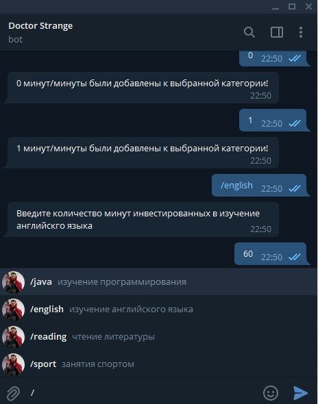
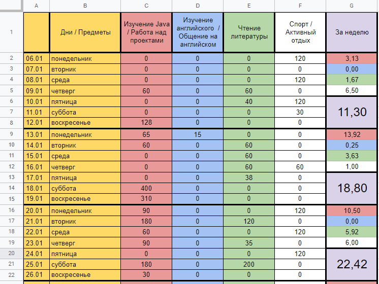

# plzSaveMyTimeBot

Telegram bot that logs messages into Google Sheets.  
I use it to track time spent on learning and important activities.

## How it works

1. Send a message to the bot in Telegram (e.g. `SwiftUI 45m`)
2. The bot parses the input and appends a new row to Google Sheets

## Tech

- Telegram Bot API
- Google Sheets API

## Screenshots

  

## Notes

This project was built as a personal productivity tool.
